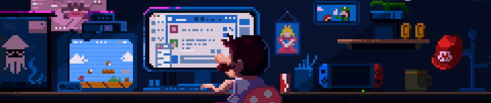

<h2 align="center">
  
</h2>
<h3 align="center">I'm a passionate B.Tech (IT) student at G H Raisoni College, Pune,   with a good foundation in MERN stack and Android development.   💻 Skilled in Java, JavaScript, React.js, Node.js, Firebase, and MongoDB.  🔧 Proficient with tools like Git, Figma, Postman, and RESTful APIs.  🏆 1st Runner-Up in a Blind C Coding Competition   🚀 Open to internships, freelance projects, and collaborative hackathons!</h3>

  

  

    
  

  

    
- 👨‍💻 MY Portfolio [Link](https://narendrapatne.vercel.app/)

- 💬 Ask me about **MERN Stack & Android Development**

- 📫 My Email **narendrapatne2004@gmail.com**

- 📄 My Resume [Link](https://drive.google.com/file/d/1lKuXbyyzw6lkI78gaHYP9zhK0teOivjM/view)
  

    
# 
🌐 Socials:

###

  
  
  
  

###
   
   

# 
💻 Tech Stack:

  
                      

 

# 
📊 GitHub Stats:

 

   

 

 

   

 

 

<h2 align="center">👨‍💻 Main Projects 👨‍💻</h2>
 

  
  
 

 

   

  

## 
🏆 GitHub Trophies

   
  
  

###

 

###

